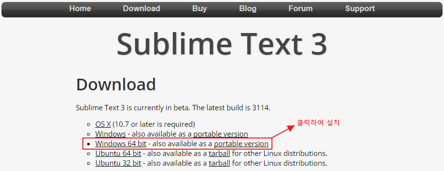

# sublimetext

기존에 사용하던 package와 단축키 설정등을 저장파일을 통해서 설치하는 방법.

### 1. sublimetext 설치

설치 url: <https://www.sublimetext.com/3>

### 2. package 저장파일 다운로드

### 3. package control 설치 
설치 url: <https://packagecontrol.io/installation>

