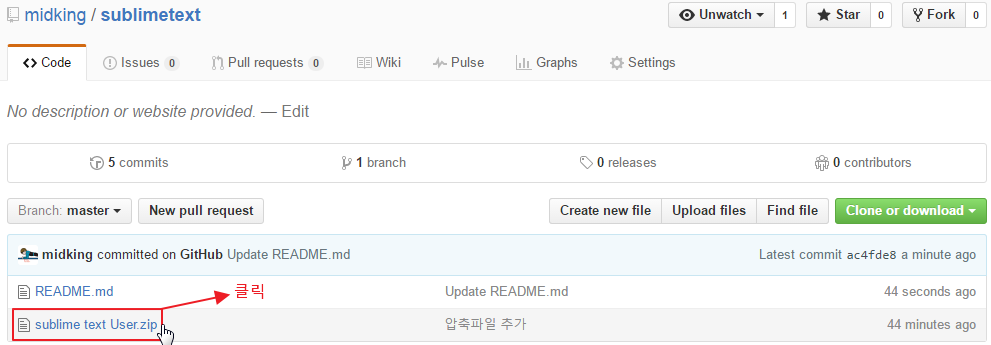
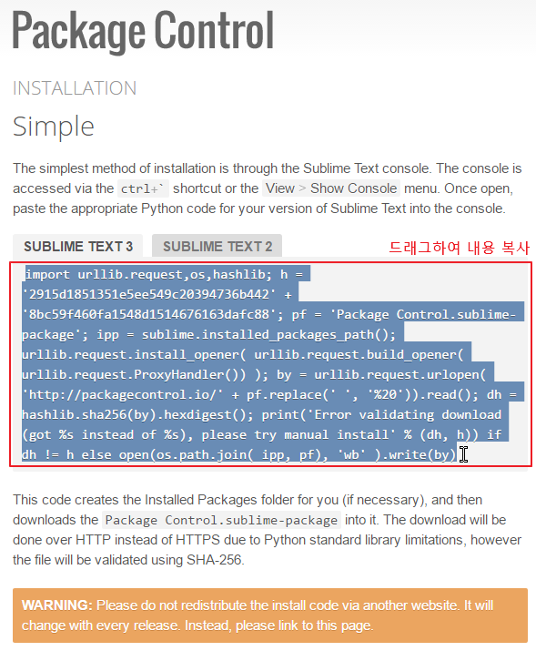

# sublimetext

기존에 사용하던 package와 단축키 설정등을 저장파일을 통해서 설치하는 방법.

### sublimetext 설치
url: <https://www.sublimetext.com/3>

### package 저장파일 다운로드 / 압축풀기
url: <https://github.com/midking/sublimetext>
##### 1. zip파일을 클릭

##### 2. 다운로드

##### 3. 압축풀기

### sublime에 파일 옮기기
##### 1. 폴더안의 모든 파일을 복사

##### 2. package 설치 경로로 이동

##### 3. user 폴더 안으로 들어가서

##### 4. 복사한 파일을 붙여 넣는다

### 3. package control 설치 
설치 url: <https://packagecontrol.io/installation>

